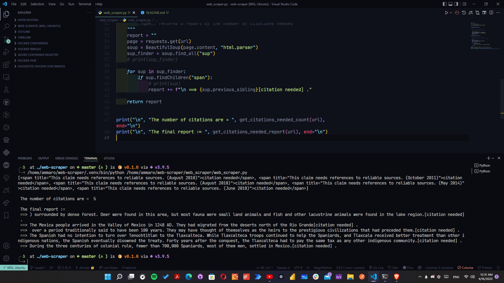

# web Scarping

**Author**: Ammar Abul-Feilat

**Version**: 0.1.0

## Overview

A simple web scraper that can be used to extract data from websites. trialed url is "https://en.wikipedia.org/wiki/History_of_Mexico" finds the citiations of the page. And the count of the citiations.

## Architecture

This app is written using Python 3.9.5, following best practices.

## Change Log

version 0.1.0 ; 15/4/2022 Initiated
